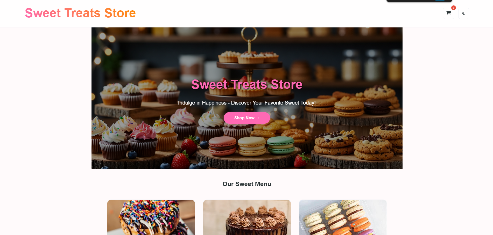
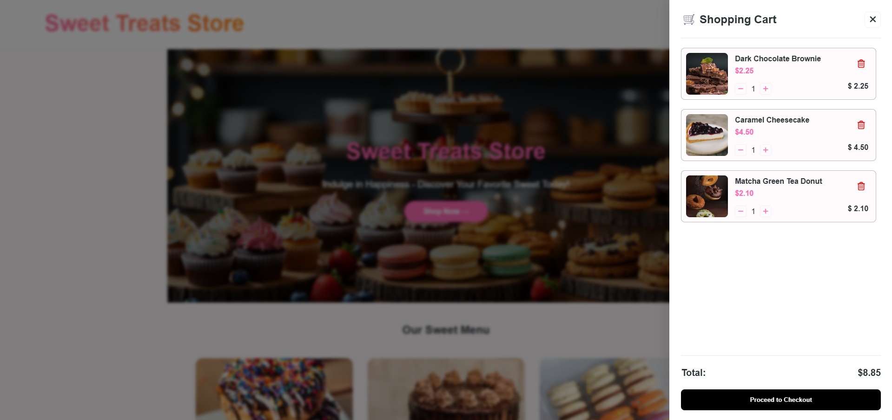

# 🍰 Sweet Treats Store - Dessert E-commerce

<div align="center">
  
  
  
</div>

<br />

**Sweet Treats Store** is a modern, responsive, and high-performance e-commerce landing page built for dessert lovers. This project focuses on a seamless user experience, modular code structure, and elegant UI design.

---

## 🚀 Live Demo

🔗 https://sweet-treats-store.vercel.app/

---

## 📸 Preview





<div align="center">
  
</div>

---

## 🚀 Core Features

- ✨ **Interactive UI/UX:** Smooth animations using AOS (Animate On Scroll).
- 🛒 **Smart Shopping Cart:** Real-time quantity updates and subtotal calculation.
- 💳 **Advanced Checkout:** Professional multi-step checkout form with payment validation.
- 🌓 **Dual Theme Support:** Fully integrated Dark and Light modes.
- 📱 **Fully Responsive:** Optimized for all screen sizes from mobile to ultra-wide desktops.
- 🔍 **SEO Ready:** Comprehensive Meta Tags for better search engine ranking.
- 📦 **Component-Based:** Modular HTML loading for easier maintenance.

---

## 🛠️ Tech Stack

- **Markup:** HTML5 (Semantic)
- **Styling:** CSS3 (Custom Variables, Grid & Flexbox)
- **Scripting:** Vanilla JavaScript (ES6 Modules)
- **Library:** [AOS.js](https://michalsnik.github.io/aos/) (Animations)
- **Icons:** [FontAwesome 6](https://fontawesome.com/)

---

## 📂 Folder Structure

```text
Dessert/
├── assets/
│   ├── css/
│   │   └── style.css       # All styles (Layout, Dark Mode, Components)
│   ├── js/
│   │   ├── script.js       # Main controller & Component loader
│   │   ├── cart.js         # Cart logic & state management
│   │   └── products.js     # Product database (Object array)
│   └── images/             # UI assets and product photos
├── components/             # Reusable HTML snippets
└── index.html              # Main landing page
```

---

## ⚙️ Local Development

1. Clone the repo

```Bash
git clone https://github.com/Saktra007/Sweet-Treats-Store
```

2. Open with Live Server
   Since the project uses JS Modules, you must use a local server (like VS Code Live Server extension) to avoid CORS issues.

3. Customize Products
   Go to assets/js/products.js to add or modify your dessert menu.
